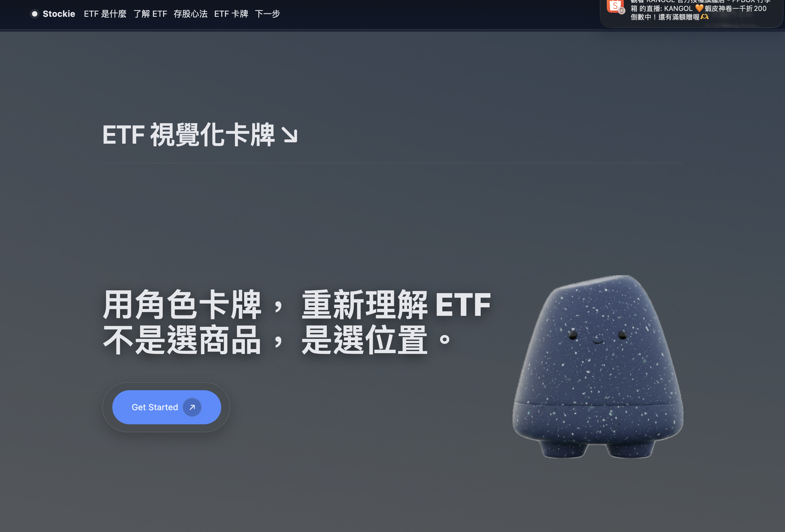
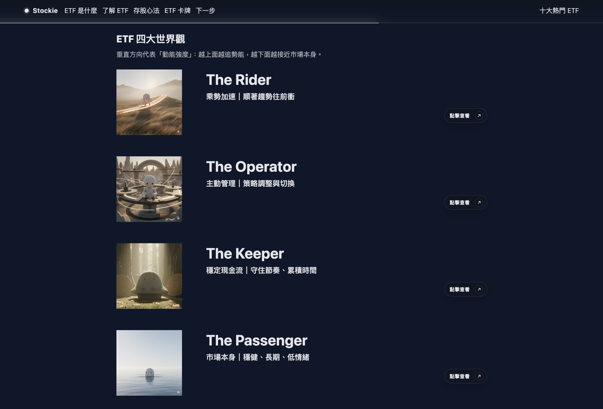
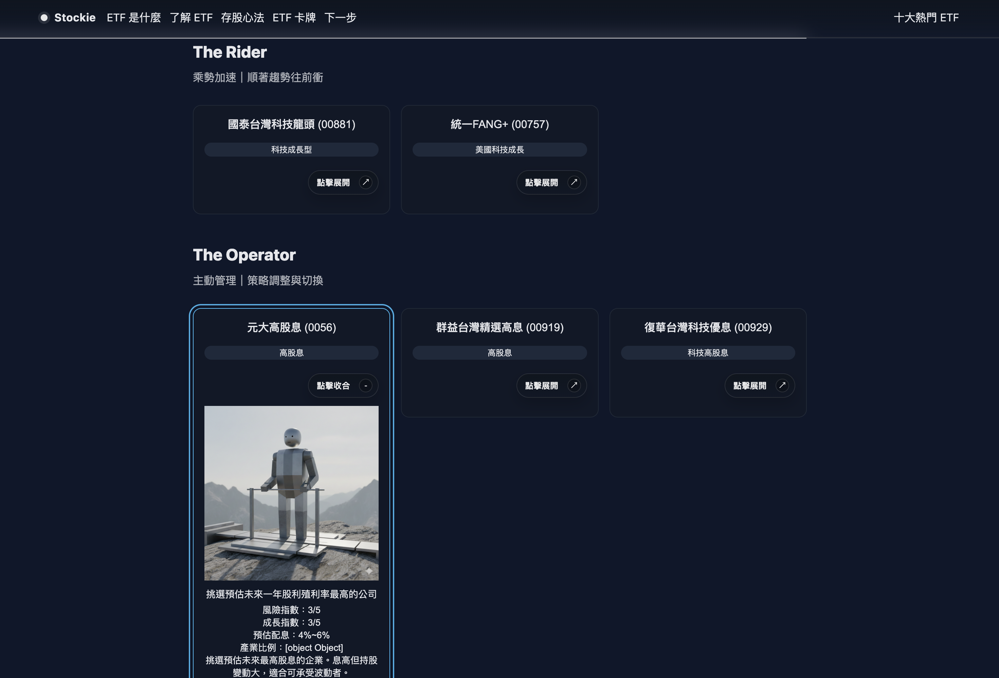

# Stockie ETF Journey

## 中文說明

Stockie ETF Journey 是一個以靜態前端製作的視覺化作品，透過角色卡牌與世界觀設計，幫助初學者用更直覺的方式理解 ETF。這個專案不以艱深金融術語切入，而是用角色、節奏、動能與位置的概念，重新詮釋不同 ETF 的差異與投資心態。

### 專案定位

這個作品將 ETF 教學內容轉化為一個具敘事感的單頁式網站，目標不是直接提供投資建議，而是降低初學者接觸金融概念時的理解門檻。網站以「不是選商品，是選位置」為核心訊息，將不同 ETF 類型映射成可感知的角色與世界觀。

### 設計理念

- 用視覺敘事取代傳統金融說明，先建立直覺，再補足概念
- 將 ETF 分成 Rider、Operator、Keeper、Passenger 四種位置，強化記憶點
- 透過卡牌互動與單頁式捲動節奏，讓閱讀體驗更像探索而不是查資料
- 讓投資新手先理解「節奏與心態」，而不是直接陷入商品比較

### 適合展示的族群

- 想展示前端視覺轉譯能力的作品集讀者
- 想看資訊設計與敘事型 UI 結合方式的面試官或審核者
- 對 ETF 概念完全陌生、需要低門檻切入點的初學者

### Demo

專案發布後，可以將線上展示連結補在這裡。

- GitHub Pages：`https://<your-github-username>.github.io/stockie-etf-journey/`

### 專案截圖






### 作品特色

- 以角色敘事方式介紹 ETF 核心概念
- 依照四種投資世界觀分類呈現互動式 ETF 卡牌
- 單頁式捲動體驗，搭配響應式導覽設計
- 純靜態網站架構，不需要額外 build 流程即可部署

### 使用者可以看到什麼

- Hero 區塊以角色視覺與標語快速建立作品主題
- 透過分段內容介紹 ETF、指數、節奏與投資心法
- 在 ETF 四大世界觀中理解不同投資位置的差異
- 在 ETF 卡牌區查看各檔 ETF 的屬性、風險、成長與描述

### 我在這個專案中練習的重點

- 將抽象金融概念轉譯成具體視覺語言
- 規劃單頁式資訊架構與捲動閱讀節奏
- 使用原生 JavaScript 產生互動式卡牌內容
- 在沒有框架與 build tool 的情況下維持結構清楚的前端檔案組織

### 使用技術

- HTML5
- CSS3
- 原生 JavaScript（ES Modules）

### 專案結構

```text
.
├── assets/
├── scripts/
├── styles/
└── index.html
```

### 本機執行方式

由於本專案使用 ES Modules，建議透過本機靜態伺服器執行，不要直接雙擊 `index.html` 開啟。

範例：

```bash
cd stockie-etf-journey
python3 -m http.server 8000
```

接著開啟 `http://localhost:8000`。

### 發布到 GitHub

```bash
git init
git add .
git commit -m "Initial commit"
git branch -M main
git remote add origin https://github.com/<your-github-username>/stockie-etf-journey.git
git push -u origin main
```

推送完成後，到 GitHub repository 的設定頁開啟 GitHub Pages，並選擇 `main` branch root 作為部署來源。

### 備註

- 此 repository 會包含專案使用到的本地素材與圖片資源。
- 若引用第三方套件，請保留其附帶的 `LICENSE.txt` 等授權文件。
- 若要作為正式作品集展示，建議補上實際 Demo 連結與網站截圖。

### 未來可優化方向

- 補上 Open Graph 與社群分享 metadata
- 壓縮圖片與整理第三方資源，讓 repository 更精簡
- 加入作品製作背景、設計流程或 wireframe，提升作品集說服力
- 補充無障礙與效能檢查結果，讓專案更完整

---

## English

Stockie ETF Journey is a static front-end project that translates ETF concepts into a character-driven visual experience. Instead of explaining ETFs with dense financial terms, the site introduces them through roles, behavior, rhythm, and momentum so beginners can build intuition first.

### Project Positioning

This project turns ETF education into a narrative-driven landing page experience. Rather than offering direct investment advice, it aims to lower the learning barrier for beginners by translating financial concepts into more approachable visual metaphors.

### Design Approach

- Replace finance-heavy explanations with visual storytelling
- Map ETF types into four recognizable worldviews: Rider, Operator, Keeper, and Passenger
- Use card interactions and a single-page scroll structure to create an exploratory reading flow
- Emphasize investment rhythm and mindset before product comparison

### Demo

After publishing this repository, add your live site link here.

- GitHub Pages: `https://<your-github-username>.github.io/stockie-etf-journey/`

### Screenshots


### Features

- Character-based storytelling for ETF concepts
- Interactive ETF cards grouped by four investment worldviews
- Single-page scrolling experience with responsive navigation
- Static deployment friendly structure with no build step required

### What Users Can Explore

- A hero section that introduces the project through character imagery and messaging
- Guided sections covering ETF basics, indexes, timing, and beginner mindset
- A four-worldview framework for understanding investment positions
- Interactive ETF cards with attributes, risk level, growth potential, and descriptions

### Key Learning Goals In This Project

- Translating abstract financial ideas into clear visual language
- Structuring a narrative single-page information architecture
- Rendering interactive card content with vanilla JavaScript
- Keeping a static front-end project organized without a framework or build step

### Tech Stack

- HTML5
- CSS3
- Vanilla JavaScript (ES modules)

### Project Structure

```text
.
├── assets/
├── scripts/
├── styles/
└── index.html
```

### Run Locally

Because this project uses ES module imports, open it with a local static server instead of double-clicking the HTML file.

Example:

```bash
cd stockie-etf-journey
python3 -m http.server 8000
```

Then visit `http://localhost:8000`.

### Publish To GitHub

```bash
git init
git add .
git commit -m "Initial commit"
git branch -M main
git remote add origin https://github.com/<your-github-username>/stockie-etf-journey.git
git push -u origin main
```

After pushing, enable GitHub Pages in the repository settings and choose the `main` branch root as the source.

### Notes

- The repository includes local assets and images used by the project.
- Keep `LICENSE.txt` files from third-party assets when applicable.
- For a stronger portfolio presentation, add a real demo URL and screenshots.

### Possible Next Improvements

- Add Open Graph and social sharing metadata
- Compress images and trim third-party assets to reduce repository size
- Document design intent, process, or wireframes for portfolio review
- Add accessibility and performance review notes
